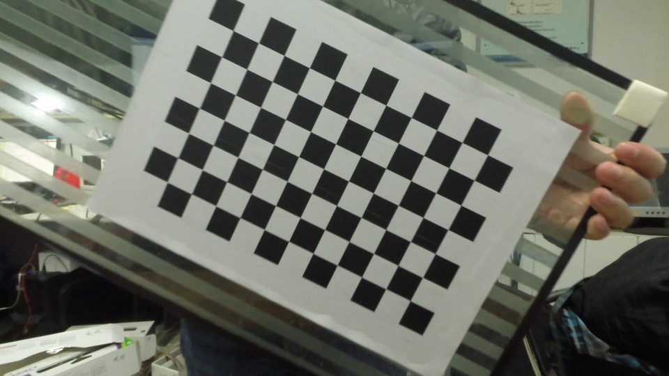
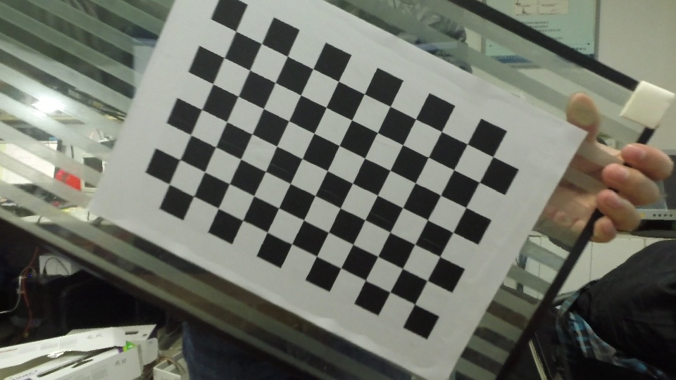
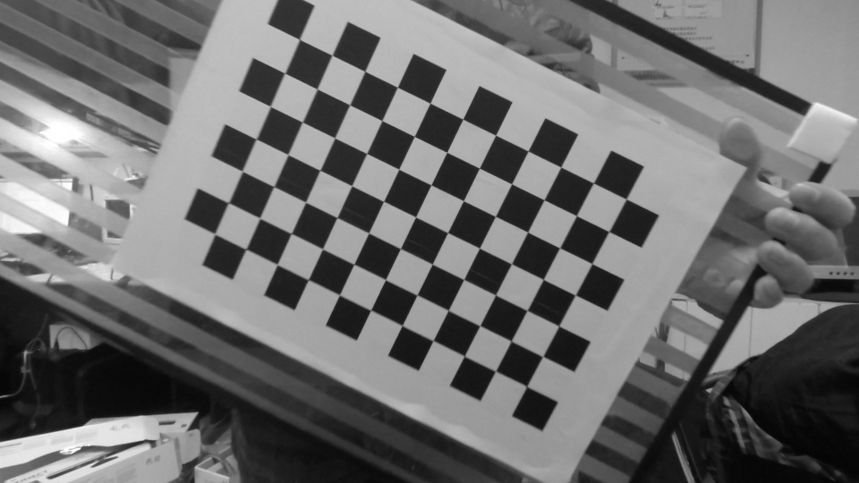

#The EICAM library
------------------------------------------------------------------------------

##1. Introduction
------------------------------------------------------------------------------
The EICAM is the a part of [PIL](https://github.com/zdzhaoyong/PIL) library, which includes some pretty useful tools for C++ programing espesially in the areas of moblile robotics and CV (computer vision). Since cameras projection and unprojection actions are often needed in CV or other area such as Robot localization like SLAM (simultaneous localization and mapping), we provided EICAM for efficient implimentation of different camera models including PinHole, ATAN, OpenCV, OCAM .etc.

This documentation will briefly introduce the usage of the library and focus on the camera models introduction.

##2. Resources and Compilation
------------------------------------------------------------------------------
###2.1. Resources
  * Download the latest code with: 
    * Git: 
    
            git clone https://github.com/zdzhaoyong/EICAM
  * Also you can download the whole PIL library: 
    * Git: 
    
            git clone https://github.com/zdzhaoyong/PIL

###2.2. Compilation
As we develop the whole project on Linux, only compilation *Makefile* for linux is provided. But since only *pthread* dependency is required (acqually no dependency for linux), it can be easily transplanted on Windows, Mac or other embedded systems.
> Warnning: Sophus and vikit_common with Eigen is needed for comparison and they are integraded in the Thirdparty folder. The Svar class is used for parameters configuration and the detail introduction of it can be found at  [PI_Base](http://zhaoyong.adv-ci.com/pibase/).

If you are using linux systems, it can be compiled with one command:

    cd EICAM;make

We highly recommand users to compile it with *c++11* standard as some fuctions in *std::tr1* should be used.


##3. Usage and demos
------------------------------------------------------------------------------
###3.1. Run the demo
After compilation, the application will be listed in folder *bin*, but since it does not hold the data, we highly recommand you to run the demo at the application folder.
Run the demo CameraTest:
`cd apps/CameraTest`
`make run`
In this demo, we compare different camera models and their implimentations in both accuracy and efficiency, in which the EICAM obtains the best performence and keeps very easy to use. 
###3.2. Usage demo
Just given the name or file, a camera can be created and all the cameras shares the two important functions: 
```cpp
// file Cameras.h
class Camera
{
public: 
    ...
    // Project a point from the world to image
    Point2d Project(const Point3d& p3d);
    // Un-project a point from the image to the world
    Point3d UnProject(const Point2d& p2d);
    ...
};
```
Simple usage demo:
```cpp
// file CameraDemo.cpp
#include <base/Svar/Svar.h>
#include <hardware/Camera/Cameras.h>

int main(int argc, char** argv)
{
    // Parse the configuration
    svar.ParseMain(argc,argv);
    // Create a camera from name
    Camera camera(svar.GetString("Camera.Name","DefaultCamera"));
    std::cout<<"Loaded camera:"<<camera.info()<<std::endl;
    if(!camera.isValid()) return -1;
    // Unproject 
    pi::Point2d p_img(0,0);
    pi::Point3d p_world=camera.UnProject(p_img);
    // Project
    pi::Point2d p_rep=camera.Project(p_world);
    // Reprojection error
    double rep_err=(p_rep-p_img).norm();
    cout<<"P_img:"<<p_img<<",P_world:"<<P_world
        <<",P_rep:"<<p_rep<<",RepError:"<<rep_err;
    return 0;
}
```
The contents of configuration file "Default.cfg":
```bash
// file Default.cfg
Camera.Name                 = GoProMiddle1080

//--------------------------GoProMiddle1080-------------------------------------
//Calibrate in 2015.04.28 Online V4L
//0.546961 0.972407 0.507881 0.490764 -0.846617 RME:0.2
GoProMiddle1080.CameraType  = PTAM
GoProMiddle1080.width       = 1920
GoProMiddle1080.height      = 1080
GoProMiddle1080.fx          = 1050.16512
GoProMiddle1080.fy          = 1050.19956
GoProMiddle1080.cx          = 975.13152
GoProMiddle1080.cy          = 530.02512
GoProMiddle1080.w           = -0.846617
GoProMiddle1080.RME         = 0.2

// The parameters can be also writed together, 
// in order of width height fx fy cx cy ...
GoProIdeaM1080.CameraType   = PinHole
GoProIdeaM1080.Paraments    = [1920 1080 1110 1110 960 540]
```
All the parameters are read by Svar, see [PI_Base](http://zhaoyong.adv-ci.com/pibase/) for the details.

###3.2. Time usage statistics
The follow table is obtained from the result of demo CameraTest, where for each camera instance 1. million times of projection and unprojection function are called. 
```
---------------------------- ZhaoYong::Timer report --------------------------
CameraType::Implimentation::FUNCTION       #CALLS  MIN.T  MEAN.T  MAX.T  TOTAL 
------------------------------------------------------------------------------
ANTA::Old::Project                           1   40.4ms  40.4ms  40.4ms  40.4ms
ANTA::Old::UnProject                         1   57.4ms  57.4ms  57.4ms  57.4ms
ANTA::VK::Project                            1   47.9ms  47.9ms  47.9ms  47.9ms
ANTA::VK::UnProject                          1   52.4ms  52.4ms  52.4ms  52.4ms
ATAN::New::Project                           1   48.6ms  48.6ms  48.6ms  48.6ms
ATAN::New::UnProject                         1   49.2ms  49.2ms  49.2ms  49.2ms
DoNothing                                    1    1.0us   1.0us   1.0us   1.0us
OCAM::New::Project                           1   83.1ms  83.1ms  83.1ms  83.1ms
OCAM::New::UnProject                         1   33.0ms  33.0ms  33.0ms  33.0ms
OpenCV::New::Project                         1   10.0ms  10.0ms  10.0ms  10.0ms
OpenCV::New::UnProject                       1  541.2ms 541.2ms 541.2ms 541.2ms
OpenCV::Old::Project                         1   10.5ms  10.5ms  10.5ms  10.5ms
OpenCV::Old::UnProject                       1  540.3ms 540.3ms 540.3ms 540.3ms
OpenCV::VK::Project                          1   16.7ms  16.7ms  16.7ms  16.7ms
OpenCV::VK::UnProject                        1  539.2ms 539.2ms 539.2ms 539.2ms
PinHole::New::Project                        1    7.7ms   7.7ms   7.7ms   7.7ms
PinHole::New::UnProject                      1    7.8ms   7.8ms   7.8ms   7.8ms
PinHole::Old::Project                        1    8.8ms   8.8ms   8.8ms   8.8ms
PinHole::Old::UnProject                      1    8.1ms   8.1ms   8.1ms   8.1ms
PinHole::VK::Project                         1    9.8ms   9.8ms   9.8ms   9.8ms
PinHole::VK::UnProject                       1   29.4ms  29.4ms  29.4ms  29.4ms
UndistorionFastGray                          1    1.3ms   1.3ms   1.3ms   1.3ms
UndistorionGray                              1    4.7ms   4.7ms   4.7ms   4.7ms
Undistortion                                 1   20.0ms  20.0ms  20.0ms  20.0ms
UndistortionFast                             1    2.0ms   2.0ms   2.0ms   2.0ms
----------------------- End of ZhaoYong::Timer report ------------------------
```
The table shows that the new version obtains the best performance.
| Bilinear Interpolation   | Nearist Interpolation (fast operation)  |
| --------   | :----:  |
|result(20.0ms)|result_fast(2.0ms)|
|gray_result(4.7ms)|grayfast(1.3ms)|

##4. Contact
------------------------------------------------------------------------------
If you have any problem, or you have some suggestions for this code, 
please contact Yong Zhao by zd5945@126.com, thank you very much!
